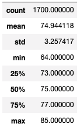
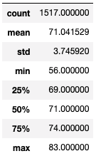
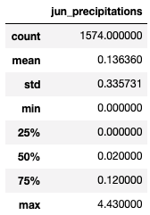
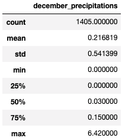

# surfs_up
## Overview of the statistical analysis

### Purpose:
To develop a business plan for potential investors of a surf and shake shop that will sell surfing gear and ice cream in Hawaii. The success of the business will very likely depend on the weather. Therfore, the below results and summary provide the needed information to facilitate decision making. 

## Results

### Key differences in weather between June and December

- The average temperature for June is 74 and for December it is 71 degrees.
- The minimum temperature in June is 64 and for December it is 56 degrees.
- The maximum temperature in June is 85 and for December it is 83 degrees.  

  

## Summary: 

### Summary of the results
The higher the weather the more potential success for this type of business. Overall, it appears that June would bring more customers in both looking for surfing equipment and also for refreshments during high temperatures. However, since we want the business to succeed year round, another consideration would be to include items that could also be offered during cool months. For example, selling hot chocolate in December. Surfing, is a year round sport and enthusiasts will travel the world searching for the best waves. It is recommended that further research be done in the heights of the waves and wind data. Wet suits are meant to be used during cooler weather and should be included in the inventory as well. 

### Two additional queries
An additional analysis was made to compare the precipation during June and December. 
- The average precipitation for June is .14 and .22 for December.
- The minimum precipitation in June is .00 and .00 for December.
- The maximum precipitation in June is 4.43 and 6.42 for December.
In conclusion, it appera that it rains slightly more during December, but not significantly more. 

  